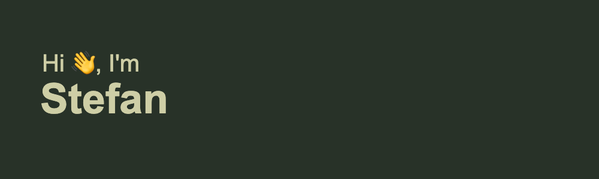

I'm a **Fullstack Web Developer** with a strong background in frontend technologies. Currently, I’m diving deep into building scalable and user-friendly applications, while also nurturing my passions outside of coding.

- 🔭 I’m currently working on **building a community platform** for creatives to exchange constructive feedback on their works
- 🌱 I’m expanding my skills by **learning Next.js** and developing fullstack applications
- 👯 I’m eager to **collaborate on remote projects** that challenge me to grow and learn
- 🎵 When I’m not coding, you’ll find me producing **Electronic Music**, training in **Muay Thai** 🥋, or practicing **Calisthenics** 🏋️‍♂️

## My Skill Set  
<table><tr><td valign="top" width="50%">

### Frontend  

  
<picture></picture>
<picture></picture>
<picture></picture>
<picture></picture>
<picture></picture>
<picture></picture>
<picture></picture></a>  
<picture></picture></a>  
<picture></picture></a>  
<picture></picture>

</td><td valign="top" width="50%">

### Backend  

  
<picture></picture>
<picture></picture>
<picture></picture> 
<picture></picture> 
<picture></picture> 
<picture></picture> 
<picture></picture>
<picture></picture> 

</td></tr></table>  

 

## Connect with me  

<a href="https://github.com/Esteban478" target="_blank">
<picture>
</a>
<a href="https://linkedin.com/in/stefan-kohnen" target="_blank">
<picture>
</a>  

  

 
Let’s connect and build something great together!
